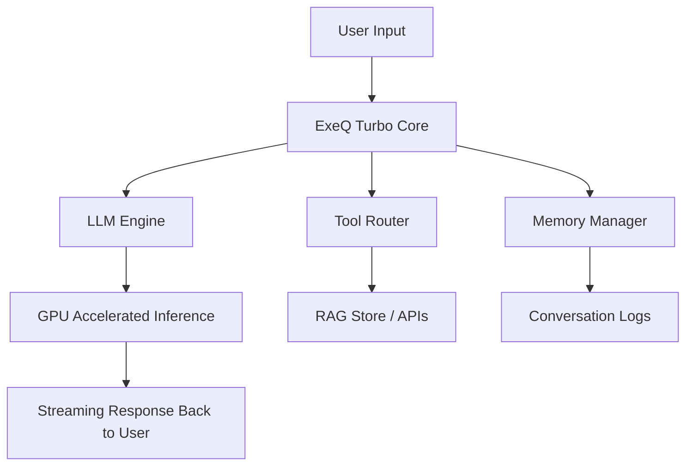

# ⚡️ ExeQ Turbo

> *“Let all the complexities be executed with the speed of the light.”*  
> 🚀 Ultra-fast, light-powered execution engine for complex reasoning and AI workloads.

---

## 🌌 Overview

**ExeQ Turbo** is a next-gen execution framework built to **handle complexities at light speed**.  
It combines **LLM-based reasoning**, **streaming responses**, and **GPU-accelerated compute** into a single, elegant system.

Designed for:
- ⚡️ **Developers** who want lightning-fast prototyping.  
- 🧠 **Researchers** who need complex reasoning.  
- 🏢 **Teams** looking for a production-ready AI engine.

---

## ✨ Key Features

- 🔥 **Ultra-Fast Execution** — Optimized with Flash-Attention & CUDA cores.  
- 🧩 **Complexity Handling** — From structured data to unstructured text.  
- 📡 **Streaming Responses** — Real-time interaction at sub-200ms latency.  
- 🌍 **Multilingual Support** — Scale your ideas across languages.  
- 🛠 **Customizable Modularity** — Plug in your own tools, agents, and RAG pipelines.  
- 🔒 **Production Ready** — Token budgeting, memory management, and safe execution.

---

## 🏗 Architecture


---

# Clone the repo
git clone https://github.com/your-org/exeq-turbo.git
cd exeq-turbo

---

# Create environment
conda create -n exeq-turbo python=3.11 -y
conda activate exeq-turbo

---

# Project environment
```
exeq-turbo/
│── app.py                # FastAPI entrypoint
│── requirements.txt      # Dependencies
│── src/
│   │── core/             # Core engine
│   │── memory/           # History & token budgeting
│   │── tools/            # RAG & external tool router
│   │── models/           # LLM integrations
│── tests/                # Unit & integration tests
│── docs/                 # Documentation
```

---

# Install dependencies
pip install -r requirements.txt

---

# Running locally
python app.py

---

# Example curl request
curl -X POST http://localhost:5001/chat \
     -H "Content-Type: application/json" \
     -d '{"message": "Can you tell me how fast the ExeQ-Turbo is?!"}'
